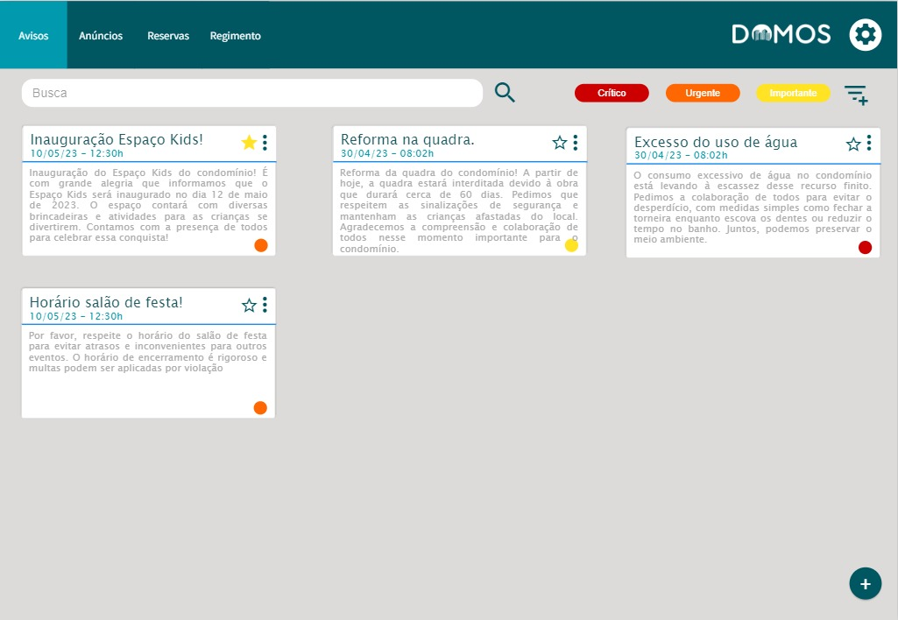
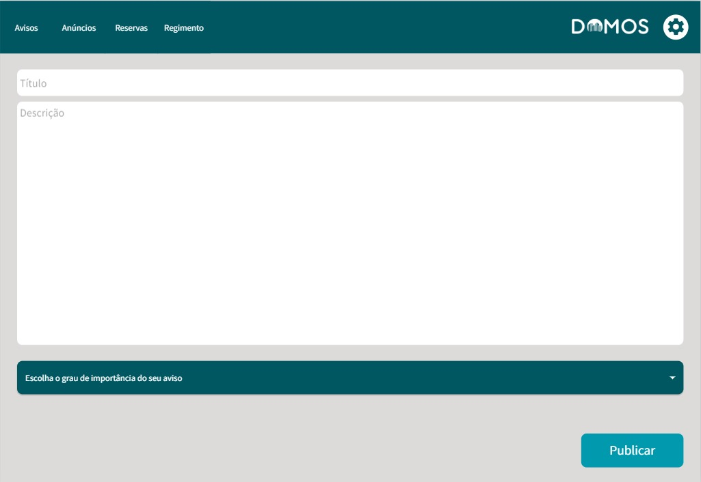
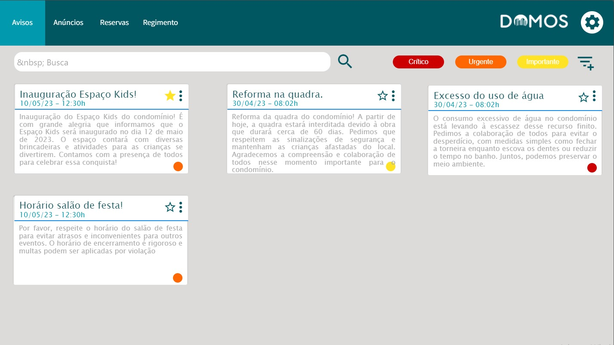
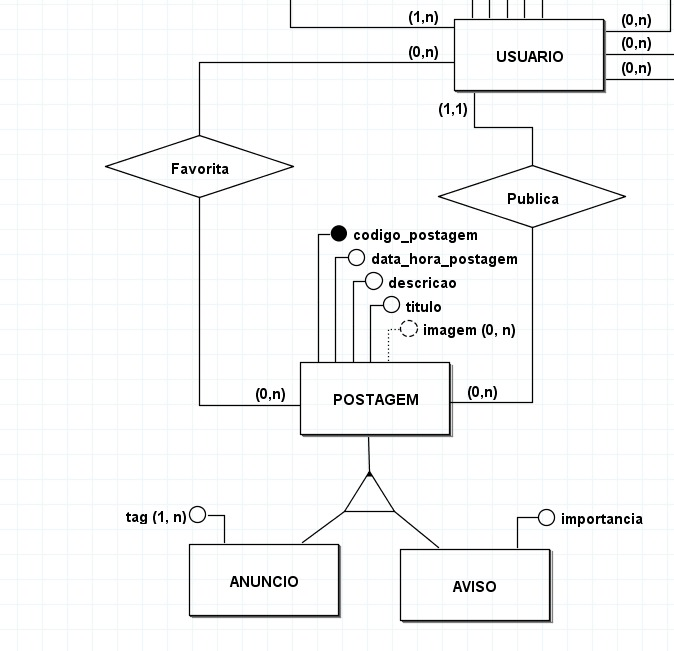

# TRABALHO DE PI:  Domos 
Trabalho desenvolvido durante a disciplina de Banco de Dados do Integrado

# Sumário
### 1. COMPONENTES 
Integrantes do grupo 
Camila Fraga Egydio: camilafragaegydio@gail.com  
Davi Nunes Ribeiro: davinunesribeiro@gmail.com 
Isabelly Balestrassi Nunes de Andrades: isabellyandrades.ifes@gmail.com  
Yasmin Santana Rodrigues: mamin8172@gmail.com  

### 2.MINIMUNDO 
O Domos é uma plataforma web e mobile para a comunicação e organização em condomínios. A plataforma permite que os moradores compartilhem anúncios de produtos e serviços prestados, acessem informações importantes e agendem espaços de festas e confraternizações com facilidade. Para isso, o sistema primeiro armazenaria o condomínio,  com seu código, que é identificador, seu cnpj, nome, quantidade de divisões e o link para o arquivo de regimento interno. A tabela de condomínio está ligada às tabela de: tipos de moradia, que possui código (identificador) e nome; faixa de quantidade de moradores, que tem código (identificador) e a descrição da faixa escolhida; endereço, que está ligada a uma cadeia de tabelas bairro, cidade, estado e país, todas com código (identificador) e nome como atributos, com exceção da estado, que possui código (identificador) e UF como atributos, e endereço também está ligado a tipo de logradouro, que possui código  (identificador) e nome; espaços públicos, que possui código (identificador) e nome, e está ligado a tipos de espaços públicos, que também possui código (identificador) e nome; divisão, com código (identificador) e descrição e ligado ao tipo de divisão, que possui código (identificador) e nome; usuário, que possui cpf (identificador), nome, email, senha e imagem (opcional). O usuário pode publicar ou favoritar postagens, que podem ser anúncios ou avisos. Postagens possuem código (identificador), data e hora da postagem, descrição, título e imagem (nenhuma ou várias), e o que diferencia um anúncio de um aviso é o atributo de tag (uma ou várias, para anúncios) e importância (apenas uma, para avisos). O usuário pode reservar espaços públicos, armazenando o código da reserva (identificador), a data, a hora de entrada e hora de saída no momento da reserva e todo usuário possui um nível de permissão, que contém código (identificador) e tipo (síndico, morador e administrador); e o usuário mora numa moradia, que possui código (identificador) e é formada pela união de uma divisão com o número da moradia, que possui número e código (identificador).
 
 
### 3.PMC 

#### 3.1. EAP - Estrutura Analítica do Projeto
  

#### 3.2. Requisitos funcionais e não funcionais
**Requisitos funcionais**

  
**Requisitos não funcionais**
  

#### 3.3 Validação da Ideia.
**Formulário:** https://docs.google.com/forms/d/1UVo8cfiToc55kceu3vzgRaVAiUsT3d8eUm1UVY6vaIY/edit  
**Relatório:** https://www.canva.com/design/DAFjLUgTWOE/O7eW_Np8ccUgRKZSzz4PeQ/edit?analyticsCorrelationId=5fb6e34d-741c-49a8-8a73-0285c9f5ed47

### 4.Personas e Histórias de usuário
a)   
  
  
  
  
 
  
  

### 5. PROTÓTIPOS DO SISTEMA 

#### 5.1 PROTÓTIPO DO SISTEMA MOBILE
https://quant-ux.com/#/apps/644920c703e7a20038a8b23b/design/s10484_99706.html

#### 5.2 PROTÓTIPO DO SISTEMA WEB
https://quant-ux.com/#/apps/6434194257bd5377df476056/design/s10000_67130.html

#### 5.3 QUAIS PERGUNTAS PODEM SER RESPONDIDAS COM OS SISTEMA WEB/MOBILE PROPOSTOS? 
* Saber quantas postagens cada morador realizou no aplicativo.
* Mostrar quantas vezes cada postagem foi favoritada
* Mostrar quantas vezes cada tipo de importância foi utilizado.
* Mostrar quantas vezes cada tag foi utilizada nos anúncios.
* Mostrar a quantidade de espaços públicos em cada condomínio.
* Mostra o percentual de quantos condominios possuem certo tipo de moradia
 
 #### 6.MODELO CONCEITUAL 
 A) 
    B) As principais entidades desse sistema em desenvolvimento são USUÁRIO, CONDOMÍNIO e POSTAGEM  
    C) Os principais fluxos de informação desse sistema são USUÁRIO, POSTAGEM e CONDOMÍNIO

#### 7 Descrição dos dados 

    TIPO_LOGRADOURO: tabela que armazena as informações do tipo de logradouro
    - codigo_tipo_logradouro: Chave primária que identifica o tipo de logradouro.
    - nome: Uma string de até 60 caracteres que representa o nome do tipo de logradouro.

    PAIS: tabela que armazena as informações do país
    - codigo_pais: Chave primária que identifica o país.
    - nome: Uma string de até 41 caracteres que representa o nome do país.

    ESTADO:  tabela que armazena as informações do estado
    - codigo_estado: Chave primária que identifica o estado.
    - uf: Uma string de até 2 caracteres que representa a sigla do estado.

    CIDADE:  tabela que armazena as informações da cidade 
    - codigo_cidade: Chave primária que identifica a cidade.
    - nome: Uma string de até 58 caracteres que representa o nome da cidade.

    BAIRRO:  tabela que armazena as informações do bairro
    - codigo_bairro: Chave primária que identifica o bairro.
    - nome: Uma string de até 60 caracteres que representa o nome do bairro.

    ENDERECO:  tabela que armazena as informações do país
    - codigo_endereco: Chave primária que identifica o endereço.
    - numero: Um número inteiro que representa o número do endereço.
    - desc_logradouro: Uma string de até 200 caracteres que descreve o logradouro do endereço.
    - cep: Uma string de até 9 caracteres que representa o CEP do endereço.
	
	TIPOS_ESPACOS_PUBLICOS:  tabela que armazena as informações dos tipos de espaço público
    - codigo_tipos_espacos_publicos: Chave primária que identifica o tipo de espaço público.
    - nome: Uma string de até 50 caracteres que representa o nome do tipo de espaço público.
	
	ESPACOS_PUBLICOS:  tabela que armazena as informações dos espaços publicos
    - codigo_espacos_publicos: Chave primária que identifica o espaço público.
    - nome: Uma string de até 100 caracteres que representa o nome do espaço público.

    TIPO_MORADIA:  tabela que armazena as informações do tipo de moradia (casa, ap etc)
    - codigo_tipo_moradia: Chave primária que identifica o tipo de moradia.
    - nome: Uma string de até 24 caracteres que representa o nome do tipo de moradia.

    FAIXA_QTD_MORADORES:  tabela que armazena as informações do faixa de quantidade de moradores (50-100, 100-500 etc)
    - codigo_faixa: Chave primária que identifica a faixa de quantidade de moradores.
    - faixa_qtd: Uma string de até 10 caracteres que descreve a faixa de quantidade de moradores.

    DIVISAO:  tabela que armazena as informações da divisão (A B C, rosa girassol etc)
    - codigo_divisao: Chave primária que identifica a divisão.
    - desc_divisao: Uma string de até 100 caracteres que descreve a divisão.
	
	TIPO_DIVISAO:  tabela que armazena as informações do tipo de divisão (bloco, setor etc)
    - codigo_tipo_divisao: Chave primária que identifica o tipo de divisão.
    - nome: Uma string de até 80 caracteres que representa o nome do tipo de divisão.
	
	REGIMENTO: tabela que armazena as informações do regimento.
	codigo_regimento: Chave primária que identifica o código do regimento.
	regimento: Uma string de até 500 caracteres que representa o regimento.

    CONDOMINIO:  tabela que armazena as informações do condomínio 
    - cnpj: Uma string de até 14 caracteres que representa o CNPJ do condomínio.
    - nome: Uma string de até 100 caracteres que representa o nome do condomínio.
    - qtd_divisoes: Um número inteiro que representa a quantidade de divisões no condomínio.
    - codigo_condominio: Chave primária que identifica o condomínio.
    - senha: Uma string de até 80 caracteres que representa a senha da conta do condomínio.
    - email: Uma string de até 100 caracteres que representa o email do condomínio.
	
	CONDOMINIO_DIVISAO:  tabela de relaçao que armazena as informações da divisão com o condomínio

    CONDOMINIO_ESPACOS_PUBLICOS: tabela de relaçao que armazena as informações dos espaços públicos com o condomínio
	
	NUM_MORADIA:  tabela que armazena as informações do número da moradia (101, 25 etc)
    - codigo: Chave primária que identifica o número de moradia.
    - numero_moradia: Uma string de até 4 caracteres que representa o número de moradia.

    MORADIA:  tabela que armazena as informações da moradia
    - codigo: Chave primária que identifica a moradia.
    
	NIVEL_PERMISSAO: tabela que armazena as informações do nivel de permissão
	codigo_nivel_permissao: Chave primária que identifica o nivel de permissão. 
	tipo: Uma string de até 15 caracteres que representa o email do condomínio.

    USUARIO:  tabela que armazena as informações do usuário
    - cpf: Chave primária que identifica o usuário.
    - nome: Uma string de até 100 caracteres que representa o nome do usuário.
    - email: Uma string de até 256 caracteres que representa o e-mail do usuário.
    - senha: Uma string de até 80 caracteres que representa a senha do usuário.
	
	USUARIO_IMAGEM: tabela que armazena as imagens do usuário
	
	POSTAGEM:  tabela que armazena as informações da postagem
    - codigo_postagem: Chave primária que identifica a postagem.
    - data_hora_postagem: Uma data e hora que representa a data e hora de postagem.
    - descricao: Uma string de até 4000 caracteres que representa a descrição da postagem.
    - titulo: Uma string de até 100 caracteres que representa o título da postagem.
	
	POSTAGEM_IMAGEM: tabela que armazena as imagens do usuário

    TAG:  tabela que armazena as informações das tags do anúncio (alimentação, serviços etc)
    - codigo: Chave primária que identifica a tag.
    - tag: Uma string de até 80 caracteres que representa a tag.

    ANUNCIO:  tabela que armazena as informações do anúncio

    IMPORTANCIA:  tabela que armazena as informações da importância de cada aviso (importante, urgente e crítico)
    - codigo: Chave primária que identifica a importância.
    - importancia: Uma string de até 80 caracteres que representa a importância.

	AVISO:  tabela que armazena as informações do aviso

    FAVORITA:  tabela de relaçao que armazena as informações das postagens favoritas
	
	RESERVA:  tabela que armazena as informações da reserva
    - data: Uma data que representa a data da reserva.
    - hora_entrada: Uma hora que representa a hora de entrada da reserva.
    - hora_saida: Uma hora que representa a hora de saída da reserva.
    - codigo_reserva: Chave primária que identifica a reserva.

### 8	RASTREABILIDADE DOS ARTEFATOS 
a) Enquanto síndico, gostaria de publicar avisos importantes para mostrar aos moradores:   

Enquanto administrador, gostaria de criar avisos para publicar na aplicação:   

Enquanto morador, gostaria de visualizar os avisos do síndico para  não perder informações:   

b) Todos estão usando da mesma tabela.  
 
        
### 9	MODELO LÓGICO 

### 10	MODELO FÍSICO 
CREATE TABLE IMAGEM (
    codigo_imagem SERIAL NOT NULL PRIMARY KEY,
    imagem VARCHAR(500)
);

-- ENDEREÇO
CREATE TABLE TIPO_LOGRADOURO (
    codigo_tipo_logradouro SERIAL PRIMARY KEY,
    nome VARCHAR(60)
);

CREATE TABLE PAIS (
    codigo_pais SERIAL PRIMARY KEY,
    nome VARCHAR(41)
);

CREATE TABLE ESTADO (
    codigo_estado SERIAL PRIMARY KEY,
    uf VARCHAR(2),
    FK_PAIS_codigo_pais INTEGER,

    FOREIGN KEY(FK_PAIS_codigo_pais) REFERENCES PAIS(codigo_pais)
);

CREATE TABLE CIDADE (
    codigo_cidade SERIAL PRIMARY KEY,
    nome VARCHAR(58),
    FK_ESTADO_codigo_estado INTEGER,

    FOREIGN KEY(FK_ESTADO_codigo_estado) REFERENCES ESTADO(codigo_estado)
);

CREATE TABLE BAIRRO (
    codigo_bairro SERIAL NOT NULL PRIMARY KEY,
    nome VARCHAR(60),
    FK_CIDADE_codigo_cidade INTEGER,

    FOREIGN KEY(FK_CIDADE_codigo_cidade) REFERENCES CIDADE(codigo_cidade)
);

CREATE TABLE ENDERECO (
    codigo_endereco SERIAL PRIMARY KEY,
    numero INTEGER,
    desc_logradouro VARCHAR(200),
    cep VARCHAR(8),
    FK_TIPO_LOGRADOURO_codigo_tipo_logradouro INTEGER,
    FK_BAIRRO_codigo_bairro INTEGER,

    FOREIGN KEY(FK_TIPO_LOGRADOURO_codigo_tipo_logradouro) REFERENCES TIPO_LOGRADOURO(codigo_tipo_logradouro),
    FOREIGN KEY(FK_BAIRRO_codigo_bairro) REFERENCES BAIRRO(codigo_bairro)
);

-- CONDOMINIO
CREATE TABLE TIPOS_ESPACOS_PUBLICOS (
    codigo_tipos_espacos_publicos SERIAL PRIMARY KEY,
    nome VARCHAR(50)
);

CREATE TABLE ESPACOS_PUBLICOS (
    codigo_espacos_publicos SERIAL PRIMARY KEY,
    nome VARCHAR(200),
    FK_TIPOS_ESPACOS_PUBLICOS_codigo_tipos_espacos_publicos INTEGER,

    FOREIGN KEY(FK_TIPOS_ESPACOS_PUBLICOS_codigo_tipos_espacos_publicos) REFERENCES TIPOS_ESPACOS_PUBLICOS(codigo_tipos_espacos_publicos)
);

CREATE TABLE TIPO_MORADIA (
    codigo_tipo_moradia SERIAL NOT NULL PRIMARY KEY,
    nome VARCHAR(30)
);

CREATE TABLE FAIXA_QTD_MORADORES (
    codigo_faixa SERIAL NOT NULL PRIMARY KEY,
    faixa_qtd VARCHAR(10)
);

CREATE TABLE TIPO_DIVISAO (
    codigo_tipo_divisao SERIAL NOT NULL PRIMARY KEY,
    nome VARCHAR(80)
);

CREATE TABLE DIVISAO (
    codigo_divisao SERIAL NOT NULL PRIMARY KEY,
    desc_divisao VARCHAR(100),
    FK_TIPO_DIVISAO_codigo_tipo_divisao INTEGER,

    FOREIGN KEY(FK_TIPO_DIVISAO_codigo_tipo_divisao) REFERENCES TIPO_DIVISAO(codigo_tipo_divisao)
);

CREATE TABLE REGIMENTO (
    codigo_regimento SERIAL NOT NULL PRIMARY KEY,
    regimento VARCHAR(500)
);

CREATE TABLE CONDOMINIO (
    cnpj VARCHAR(14),
    nome VARCHAR(100),
    qtd_divisoes INTEGER,
    codigo_condominio VARCHAR(6) PRIMARY KEY,
    senha VARCHAR(80),
    email VARCHAR(100),
    FK_REGIMENTO_codigo_regimento INTEGER,
    FK_TIPO_MORADIA_codigo_tipo_moradia INTEGER,
    FK_ENDERECO_codigo_endereco INTEGER,
    FK_FAIXA_QTD_MORADORES_codigo_faixa INTEGER,

    FOREIGN KEY(FK_REGIMENTO_codigo_regimento) REFERENCES REGIMENTO(codigo_regimento),
    FOREIGN KEY(FK_TIPO_MORADIA_codigo_tipo_moradia) REFERENCES TIPO_MORADIA(codigo_tipo_moradia),
    FOREIGN KEY(FK_ENDERECO_codigo_endereco) REFERENCES ENDERECO(codigo_endereco),
    FOREIGN KEY(FK_FAIXA_QTD_MORADORES_codigo_faixa) REFERENCES FAIXA_QTD_MORADORES(codigo_faixa)
);

CREATE TABLE CONDOMINIO_DIVISAO(
    FK_DIVISAO_codigo_divisao INTEGER,
    FK_CONDOMINIO_codigo_condominio VARCHAR(6),
	
    FOREIGN KEY(FK_DIVISAO_codigo_divisao) REFERENCES DIVISAO(codigo_divisao),
    FOREIGN KEY(FK_CONDOMINIO_codigo_condominio) REFERENCES CONDOMINIO(codigo_condominio)
);

CREATE TABLE CONDOMINIO_ESPACOS_PUBLICOS(
    FK_ESPACOS_PUBLICOS_codigo_espacos_publicos INTEGER,
    FK_CONDOMINIO_codigo_condominio VARCHAR(6),

    FOREIGN KEY(FK_CONDOMINIO_codigo_condominio) REFERENCES CONDOMINIO(codigo_condominio),
    FOREIGN KEY(FK_ESPACOS_PUBLICOS_codigo_espacos_publicos) REFERENCES ESPACOS_PUBLICOS(codigo_espacos_publicos)
);

-- MORADIA
CREATE TABLE NUM_MORADIA (
    codigo_num_moradia SERIAL NOT NULL PRIMARY KEY,
    numero_moradia VARCHAR(4)
);

CREATE TABLE MORADIA (
    codigo_moradia SERIAL NOT NULL PRIMARY KEY,
    FK_DIVISAO_codigo_divisao INTEGER,
    FK_NUM_MORADIA_codigo_num_moradia INTEGER,

    FOREIGN KEY(FK_DIVISAO_codigo_divisao) REFERENCES DIVISAO(codigo_divisao),
    FOREIGN KEY(FK_NUM_MORADIA_codigo_num_moradia) REFERENCES NUM_MORADIA(codigo_num_moradia)
);

-- USUARIO
CREATE TABLE NIVEL_PERMISSAO (
    codigo_nivel_permissao SERIAL PRIMARY KEY,
    tipo VARCHAR(15)
);

CREATE TABLE USUARIO (
    cpf VARCHAR(14) PRIMARY KEY,
    nome VARCHAR(100),
    email VARCHAR(256),
    senha VARCHAR(80),
    FK_CONDOMINIO_codigo_condominio VARCHAR(6),
    FK_NIVEL_PERMISSAO_codigo_nivel_permissao INTEGER,
    FK_MORADIA_codigo_moradia INTEGER,

    FOREIGN KEY(FK_CONDOMINIO_codigo_condominio) REFERENCES CONDOMINIO(codigo_condominio),
    FOREIGN KEY(FK_NIVEL_PERMISSAO_codigo_nivel_permissao) REFERENCES NIVEL_PERMISSAO(codigo_nivel_permissao),
    FOREIGN KEY(FK_MORADIA_codigo_moradia) REFERENCES MORADIA(codigo_moradia)
);

CREATE TABLE USUARIO_IMAGEM(
    FK_USUARIO_cpf VARCHAR(14),
    FK_IMAGEM_codigo_imagem SERIAL,

    FOREIGN KEY(FK_USUARIO_cpf) REFERENCES USUARIO(cpf),
    FOREIGN KEY(FK_IMAGEM_codigo_imagem) REFERENCES IMAGEM(codigo_imagem)
);

-- POSTAGEM
CREATE TABLE POSTAGEM (
    codigo_postagem SERIAL NOT NULL PRIMARY KEY,
    data_hora_postagem TIMESTAMP,
    descricao VARCHAR(4000),
    titulo VARCHAR(100),
    FK_USUARIO_cpf VARCHAR(14),

    FOREIGN KEY(FK_USUARIO_cpf) REFERENCES USUARIO(cpf)
);

CREATE TABLE POSTAGEM_IMAGEM (
    FK_POSTAGEM_codigo_postagem SERIAL,
    FK_IMAGEM_codigo_imagem SERIAL,

    FOREIGN KEY(FK_POSTAGEM_codigo_postagem) REFERENCES POSTAGEM(codigo_postagem),
    FOREIGN KEY(FK_IMAGEM_codigo_imagem) REFERENCES IMAGEM(codigo_imagem)
);

CREATE TABLE TAG(
    codigo_tag SERIAL NOT NULL PRIMARY KEY,
    tag VARCHAR(20)
);

CREATE TABLE ANUNCIO (
    FK_TAG_codigo_tag INTEGER,
    FK_POSTAGEM_codigo_postagem INTEGER PRIMARY KEY,

    FOREIGN KEY(FK_TAG_codigo_tag) REFERENCES TAG(codigo_tag),
    FOREIGN KEY(FK_POSTAGEM_codigo_postagem) REFERENCES POSTAGEM(codigo_postagem)
);

CREATE TABLE IMPORTANCIA (
    codigo_importancia SERIAL NOT NULL PRIMARY KEY,
    importancia VARCHAR(20)
);

CREATE TABLE AVISO (
    FK_IMPORTANCIA_codigo_importancia INTEGER,
    FK_POSTAGEM_codigo_postagem INTEGER PRIMARY KEY,

    FOREIGN KEY(FK_IMPORTANCIA_codigo_importancia) REFERENCES IMPORTANCIA(codigo_importancia),
    FOREIGN KEY(FK_POSTAGEM_codigo_postagem) REFERENCES POSTAGEM(codigo_postagem)
);

-- USUARIO E POSTAGEM
CREATE TABLE Favorita (
    FK_USUARIO_cpf VARCHAR(14),
    FK_POSTAGEM_codigo_postagem SERIAL,
	
    FOREIGN KEY(FK_USUARIO_cpf) REFERENCES USUARIO(cpf),
    FOREIGN KEY(FK_POSTAGEM_codigo_postagem) REFERENCES POSTAGEM(codigo_postagem)
);

-- USUARIO E ESPAÇO PUBLICO
CREATE TABLE Reserva (
    FK_USUARIO_cpf VARCHAR(14),
    FK_ESPACOS_PUBLICOS_codigo_espacos_publicos INTEGER,
    data DATE,
    hora_entrada TIME,
    hora_saida TIME,
    codigo_reserva SERIAL PRIMARY KEY,

   FOREIGN KEY(FK_USUARIO_cpf) REFERENCES USUARIO(cpf),
   FOREIGN KEY(FK_ESPACOS_PUBLICOS_codigo_espacos_publicos) REFERENCES ESPACOS_PUBLICOS(codigo_espacos_publicos)
);

       
### 11	INSERT APLICADO NAS TABELAS DO BANCO DE DADOS 
INSERT INTO IMAGEM (codigo_imagem, imagem)
VALUES
  (1, 'https://exemplo.com/panelas.jpg'),
  (2, 'https://exemplo.com/camiseta.jpg'),
  (3, 'https://exemplo.com/smartphone.jpg'),
  (4, 'https://exemplo.com/maquiagem.jpg'),
  (5, 'https://exemplo.com/luminaria.jpg'),
  (6, 'https://exemplo.com/racao.jpg'),
  (7, 'https://exemplo.com/limpeza.jpg'),
  (8, 'https://exemplo.com/piscina.jpg'),
  (9, 'https://exemplo.com/reuniao.jpg'),
  (10, 'https://exemplo.com/elevador.jpg'),
  (11, 'https://exemplo.com/estacionamento.jpg'),
  (12, 'https://exemplo.com/seguranca.jpg'),
  (13, 'https://example.com/avatar1.png'),
  (14, 'https://example.com/avatar2.png'),
  (15, 'https://example.com/avatar3.png'),
  (16, 'https://example.com/avatar4.png'),
  (17, 'https://example.com/avatar5.png');

INSERT INTO TIPO_LOGRADOURO (codigo_tipo_logradouro, nome)
VALUES
  (1, 'Rua'),
  (2, 'Avenida'),
  (3, 'Travessa'),
  (4, 'Praça'),
  (5, 'Alameda');

INSERT INTO PAIS (codigo_pais, nome)
VALUES
  (1, 'Brasil');

INSERT INTO ESTADO (codigo_estado, uf, FK_PAIS_codigo_pais)
VALUES
  (1, 'SP', 1),
  (2, 'PB', 1),
  (3, 'RJ', 1);

INSERT INTO CIDADE (codigo_cidade, nome, FK_ESTADO_codigo_estado)
VALUES
  (1, 'São Paulo', 1),
  (2, 'São Bernardo do Campo', 1),
  (3, 'João Pessoa', 2),
  (4, 'Rio de Janeiro', 3),
  (5, 'Campinas', 1);

INSERT INTO BAIRRO (codigo_bairro, nome, FK_CIDADE_codigo_cidade)
VALUES
  (1, 'Centro', 1),
  (2, 'Jardim Vista', 2),
  (3, 'Manaíra', 3),
  (4, 'Centro', 4),
  (5, 'Parque das Flores', 5);

INSERT INTO ENDERECO (codigo_endereco, numero, desc_logradouro, cep, FK_TIPO_LOGRADOURO_codigo_tipo_logradouro, FK_BAIRRO_codigo_bairro)
VALUES
  (1, 125, 'Rua das Flores', '12020010', 1, 1),
  (2, 2034, 'Avenida do Sol', '08090520', 2, 2),
  (3, 456, 'Travessa das Palmeiras', '58045110', 3, 3),
  (4, 987, 'Praça do Sol', '01010001', 4, 4),
  (5, 360, 'Alameda das Margaridas', '13083200', 5, 5);

INSERT INTO TIPOS_ESPACOS_PUBLICOS (codigo_tipos_espacos_publicos, nome)
VALUES
  (1, 'Salão de Festas'),
  (2, 'Churrasqueira'),
  (3, 'Quadra'),
  (4, 'Sauna'),
  (5, 'Sala de Jogos'),
  (6, 'Espaço Gourmet'),
  (7, 'Espaço Kids');

INSERT INTO ESPACOS_PUBLICOS (codigo_espacos_publicos, nome, FK_TIPOS_ESPACOS_PUBLICOS_codigo_tipos_espacos_publicos)
VALUES
  (1, 'A', 1),
  (2, 'B', 1),
  (3, 'C', 1),
  (4, 'A', 2),
  (5, 'B', 2),
  (6, 'C', 2),
  (7, 'D', 2),
  (8, 'E', 2),
  (9, 'F', 2),
  (10, 'futebol', 3),
  (11, 'volei', 3),
  (12, 'tenis', 3),
  (13, '1', 4),
  (14, '1', 5),
  (15, '2', 5),
  (16, '1', 6),
  (17, '1', 7);

INSERT INTO TIPO_MORADIA (codigo_tipo_moradia, nome)
VALUES
  (1, 'Casa'),
  (2, 'Apartamento'),
  (3, 'Casa e Apartamento');

INSERT INTO FAIXA_QTD_MORADORES (codigo_faixa, faixa_qtd)
VALUES
  (1, '1-100'),
  (2, '100-500'),
  (3, '500-1000'),
  (4, '1000+');

INSERT INTO TIPO_DIVISAO (codigo_tipo_divisao, nome)
VALUES
  (1, 'Letras'),
  (2, 'Números'),
  (3, 'Cores');

INSERT INTO DIVISAO (codigo_divisao, desc_divisao, FK_TIPO_DIVISAO_codigo_tipo_divisao)
VALUES
  (1, 'A', 1),
  (2, 'B', 1),
  (3, 'C', 1),
  (4, 'D', 1),
  (5, 'E', 1),
  (6, 'F', 1),
  (7, 'G', 1),
  (8, 'H', 1),
  (9, 'I', 1),
  (10, 'J', 1),
  (11, '1', 2),
  (12, '2', 2),
  (13, '3', 2),
  (14, '4', 2),
  (15, '5', 2),
  (16, '6', 2),
  (17, '7', 2),
  (18, '8', 2),
  (19, '9', 2),
  (20, '10', 2),
  (21, 'Azul', 3),
  (22, 'Vermelho', 3),
  (23, 'Roxo', 3);

INSERT INTO REGIMENTO (codigo_regimento, regimento)
VALUES
  (1, 'https://exemplo.com/regimento_interno_residencial_das_flores.pdf'),
  (2, 'https://exemplo.com/regimento_interno_villagio_di_napoli.pdf'),
  (3, 'https://exemplo.com/regimento_interno_condominio_dos_girassois.pdf'),
  (4, 'https://exemplo.com/regimento_interno_jardim_dos_lirios.pdf'),
  (5, 'https://exemplo.com/regimento_interno_condominio_das_acacias.pdf');

INSERT INTO CONDOMINIO (cnpj, nome, qtd_divisoes, codigo_condominio, senha, email, FK_REGIMENTO_codigo_regimento, FK_FAIXA_QTD_MORADORES_codigo_faixa, FK_ENDERECO_codigo_endereco, FK_TIPO_MORADIA_codigo_tipo_moradia)
VALUES
  ('97850315790467', 'Residencial das Flores', 5, '532097', 'R3fG7s9X1$', 'residencialflores@gmail.com', 1, 2, 1, 1),
  ('67128439571218', 'Villaggio di Napoli', 10, '892356', 'P6mZ2k8@4', 'villaggiodinapoli@gmail.com', 2, 4, 2, 3),
  ('81029468093542', 'Condomínio dos Girassóis', 3, '415869', 'L9qV5j1#0', 'girassoiscondominio@gmail.com', 3, 2, 3, 2),
  ('23687451230759', 'Jardim dos Lírios', 6, '724138', 'S2cH6b4*7', 'jardimdoslirios@gmail.com', 4, 3, 4, 1),
  ('76412903576492', 'Condomínio das Acácias', 7, '301572', 'T5nY9a3%1', 'acaciascondominio@gmail.com', 5, 3, 5, 3);

INSERT INTO CONDOMINIO_DIVISAO (FK_DIVISAO_codigo_divisao, FK_CONDOMINIO_codigo_condominio)
VALUES
  (1, '532097'),
  (2, '532097'),
  (3, '532097'),
  (4, '532097'),
  (5, '532097'),
  (11, '892356'),
  (12, '892356'),
  (13, '892356'),
  (14, '892356'),
  (15, '892356'),
  (16, '892356'),
  (17, '892356'),
  (18, '892356'),
  (19, '892356'),
  (20, '892356'),
  (21, '415869'),
  (22, '415869'),
  (23, '415869'),
  (11, '724138'),
  (12, '724138'),
  (13, '724138'),
  (14, '724138'),
  (15, '724138'),
  (16, '724138'),
  (1, '301572'),
  (2, '301572'),
  (3, '301572'),
  (4, '301572'),
  (5, '301572'),
  (6, '301572'),
  (7, '301572');

INSERT INTO CONDOMINIO_ESPACOS_PUBLICOS (FK_ESPACOS_PUBLICOS_codigo_espacos_publicos, FK_CONDOMINIO_codigo_condominio)
VALUES
  (1, '532097'),
  (2, '532097'),
  (10, '532097'),
  (4, '532097'),
  (14, '532097'),
  (1, '892356'),
  (11, '892356'),
  (1, '892356'),
  (4, '892356'),
  (4, '415869'),
  (1, '415869'),
  (1, '724138'),
  (4, '724138'),
  (5, '724138'),
  (10, '724138'),
  (1, '301572'),
  (2, '301572'),
  (4, '301572'),
  (13, '301572'),
  (14, '301572'),
  (17, '301572');

INSERT INTO NUM_MORADIA (numero_moradia)
VALUES
  ('101'),
  ('202'),
  ('303'),
  ('404'),
  ('505');

INSERT INTO MORADIA (FK_NUM_MORADIA_codigo_num_moradia, FK_DIVISAO_codigo_divisao)
VALUES
  (1, 1),
  (1, 5),
  (2, 1),
  (3, 1),
  (5, 3);

INSERT INTO NIVEL_PERMISSAO (tipo)
VALUES
  ('Síndico'),
  ('Administrador'),
  ('Morador');

INSERT INTO USUARIO (cpf, nome, email, senha, FK_CONDOMINIO_codigo_condominio, FK_NIVEL_PERMISSAO_codigo_nivel_permissao, FK_MORADIA_codigo_moradia)
VALUES
  ('49628092010', 'Pedro Henrique da Silva', 'pedro.silva90@gmail.com', 'J#mD8n@KsT', '532097', 3, 1),
  ('31589904263', 'Ana Carolina Oliveira Santos', 'anacarolsantos_25@hotmail.com', '7cH$zN9mRf', '532097', 3, 2),
  ('72815390627', 'Gustavo Pereira Souza', 'gustavosouza@gmail.com', 'qP5^gB@2hE', '532097', 3, 3),
  ('42155708213', 'Fernanda Almeida Lima', 'fernandaalmeida.lima@yahoo.com', 'fY3!kT#6sL', '532097', 1, 4),
  ('86361974530', 'Guilherme Ferreira Costa', 'guilhermecosta87@outlook.com', '9vM@pG6rXy', '532097', 2, 5);

INSERT INTO USUARIO_IMAGEM (FK_USUARIO_cpf, FK_IMAGEM_codigo_imagem)
VALUES
  ('49628092010', 13),
  ('31589904263', 14),
  ('72815390627', 15),
  ('42155708213', 16),
  ('86361974530', 17);

INSERT INTO POSTAGEM (data_hora_postagem, descricao, titulo, FK_USUARIO_cpf)
VALUES
  ('2023-05-09 10:15:00', 'Conjunto de panelas antiaderente, conjunto com 5 peças', 'Conjunto de Panelas', '31589904263'),
  ('2023-05-09 13:45:00', 'Camiseta masculina, tamanho P, cor azul marinho', 'Camiseta Masculina', '49628092010'),
  ('2023-05-09 16:30:00', 'Smartphone Samsung Galaxy S21, 128GB, cor preta', 'Smartphone Samsung Galaxy S21', '31589904263'),
  ('2023-05-09 18:45:00', 'Kit de maquiagem com 10 itens, incluindo batom, sombra e pincéis', 'Kit de Maquiagem', '42155708213'),
  ('2023-05-09 20:00:00', 'Luminária de mesa em madeira e metal, com cúpula em tecido', 'Luminária de Mesa', '49628092010'),
  ('2023-05-09 21:30:00', 'Ração para cachorro, marca Pedigree, sabor frango e legumes, 1kg', 'Ração para Cachorro', '42155708213'),
  ('2023-05-10 09:00:00', 'Limpeza de ar-condicionado, serviço de limpeza em domicílio', 'Limpeza de Ar-Condicionado', '86361974530'),
  ('2023-05-09 10:15:00', 'Aviso sobre vazamento na piscina do condomínio', 'Vazamento na Piscina', '42155708213'),
  ('2023-05-09 13:45:00', 'Aviso sobre reunião de condomínio para discussão de novas medidas', 'Reunião de Condomínio', '42155708213'),
  ('2023-05-09 16:30:00', 'Aviso sobre manutenção do elevador', 'Manutenção do Elevador', '86361974530'),
  ('2023-05-09 18:45:00', 'Aviso sobre obras no estacionamento', 'Obras no Estacionamento', '42155708213'),
  ('2023-05-09 20:00:00', 'Aviso sobre troca do sistema de segurança do condomínio', 'Troca do Sistema de Segurança', '86361974530');

INSERT INTO POSTAGEM_IMAGEM (FK_POSTAGEM_codigo_postagem, FK_IMAGEM_codigo_imagem)
VALUES
  (1, 1),
  (2, 2),
  (3, 3),
  (4, 4),
  (5, 5),
  (6, 6),
  (7, 7),
  (8, 8),
  (9, 9),
  (10, 10),
  (11, 11),
  (12, 12);

INSERT INTO TAG (codigo_tag, tag)
VALUES
  (1, 'Alimentação'),
  (2, 'Confecção'),
  (3, 'Eletrônicos'),
  (4, 'Cosméticos'),
  (5, 'Decoração'),
  (6, 'Petshop'),
  (7, 'Serviços');

INSERT INTO ANUNCIO (FK_TAG_codigo_tag, FK_POSTAGEM_codigo_postagem)
VALUES
  (1, 1),
  (2, 2),
  (3, 3),
  (4, 4),
  (5, 5),
  (6, 6),
  (7, 7);

INSERT INTO IMPORTANCIA (codigo_importancia, importancia)
VALUES
  (1, 'Importante'),
  (2, 'Urgente'),
  (3, 'Crítico');

INSERT INTO AVISO (FK_IMPORTANCIA_codigo_importancia, FK_POSTAGEM_codigo_postagem)
VALUES
  (2, 8),
  (2, 9),
  (1, 10),
  (1, 11),
  (3, 12);

INSERT INTO Favorita (FK_USUARIO_cpf, FK_POSTAGEM_codigo_postagem)
VALUES
  ('49628092010', 1),
  ('31589904263', 1),
  ('49628092010', 2),
  ('72815390627', 2),
  ('31589904263', 3),
  ('31589904263', 4),
  ('42155708213', 4),
  ('86361974530', 4),
  ('49628092010', 5),
  ('42155708213', 6),
  ('49628092010', 7),
  ('72815390627', 7),
  ('49628092010', 3),
  ('31589904263', 3),
  ('72815390627', 3),
  ('49628092010', 3),
  ('49628092010', 1),
  ('31589904263', 5),
  ('86361974530', 5),
  ('86361974530', 1),
  ('72815390627', 5),
  ('49628092010', 2),
  ('31589904263', 2),
  ('72815390627', 2),
  ('86361974530', 2);

INSERT INTO Reserva (FK_USUARIO_cpf, FK_ESPACOS_PUBLICOS_codigo_espacos_publicos, data, hora_entrada, hora_saida)
VALUES
  ('72815390627', 4, '2023-07-24', '14:30:00', '16:00:00'),
  ('42155708213', 10, '2023-10-06', '14:00:00', '20:00:00'),
  ('31589904263', 1, '2023-11-14', '12:00:00', '18:00:00'),
  ('49628092010', 2, '2023-12-03', '15:00:00', '22:00:00'),
  ('42155708213', 1, '2024-01-01', '00:00:00', '02:00:00'),
  ('42155708213', 1, '2023-12-31', '22:00:00', '23:59:00');

        
#### 12 PRINCIPAIS CONSULTAS DO SISTEMA 
 
 1) Objetivo: Saber quantas postagens cada morador realizou no aplicativo.  
      select USUARIO.nome,   
      count(POSTAGEM.codigo_postagem) as qtd_postagens  
      from USUARIO INNER JOIN POSTAGEM ON USUARIO.cpf = POSTAGEM.fk_usuario_cpf  
      group by nome 
      ORDER BY qtd_postagens DESC  
       
2) Objetivo: Mostrar quantas vezes cada postagem foi favoritada  
      SELECT POSTAGEM.titulo, count(FAVORITA.fk_postagem_codigo_postagem) as qtd_favoritado  
      FROM POSTAGEM  
      INNER JOIN FAVORITA ON POSTAGEM.codigo_postagem = FAVORITA.fk_postagem_codigo_postagem  
      GROUP BY titulo  
      ORDER BY qtd_favoritado DESC  
        

3) Objetivo: Mostrar quantas vezes cada tipo de importância foi utilizado.  
      SELECT IMPORTANCIA.importancia, COUNT(POSTAGEM.codigo_postagem) as qtd_avisos  
      FROM IMPORTANCIA  
      INNER JOIN AVISO ON IMPORTANCIA.codigo = AVISO.fk_importancia_codigo  
      INNER JOIN POSTAGEM ON AVISO.fk_postagem_codigo_postagem = POSTAGEM.codigo_postagem  
      GROUP BY importancia  
      ORDER BY qtd_avisos DESC  
        
4) Objetivo: Mostrar quantas vezes cada tag foi utilizada nos anúncios.  
     SELECT TAG.tag, COUNT(POSTAGEM.codigo_postagem) as qtd_anuncios  
     FROM TAG  
     INNER JOIN ANUNCIO ON TAG.codigo = ANUNCIO.fk_tag_codigo  
     INNER JOIN POSTAGEM ON ANUNCIO.fk_postagem_codigo_postagem = POSTAGEM.codigo_postagem  
     GROUP BY tag  
     ORDER BY qtd_anuncios DESC  
      

5) Objetivo: Mostrar a quantidade de espaços públicos em cada condomínio.  
     SELECT CONDOMINIO.nome, COUNT(CONDOMINIO_ESPACOS_PUBLICOS.fk_condominio_codigo_condominio) as qtd_espacos_publicos  
     FROM CONDOMINIO  
     INNER JOIN CONDOMINIO_ESPACOS_PUBLICOS ON CONDOMINIO.codigo_condominio = CONDOMINIO_ESPACOS_PUBLICOS.fk_condominio_codigo_condominio  
     GROUP BY nome  
     ORDER BY qtd_espacos_publicos DESC  
       

6) Objetivo: Mostra o percentual de quantos condominios possuem certo tipo de moradia  
     SELECT TIPO_MORADIA.nome as nome_tipo_moradia, COUNT(CONDOMINIO.fk_tipo_moradia_codigo_tipo_moradia) as qtd_condominios  
     FROM TIPO_MORADIA  
     INNER JOIN CONDOMINIO ON TIPO_MORADIA.codigo_tipo_moradia	= CONDOMINIO.fk_tipo_moradia_codigo_tipo_moradia  
     GROUP BY nome_tipo_moradia  
       

 ### 13 Gráficos, relatórios, integração com Linguagem de programação e outras solicitações. 
    
     https://colab.research.google.com/drive/13nVozNQjaOaS75BLCi7XpIz4VG8T6dj7?authuser=1#scrollTo=P2G05MqfxFYj
 
 ### 14 Slides e Apresentação em vídeo.  
     OBS: Observe as instruções relacionadas a cada uma das atividades abaixo. 
 #### 14.1 Slides;  
 #### 14.2 Apresentação em vídeo  

    
##### About Formatting
    https://help.github.com/articles/about-writing-and-formatting-on-github/
    
##### Basic Formatting in Git
    
    https://help.github.com/articles/basic-writing-and-formatting-syntax/#referencing-issues-and-pull-requests
   
    
##### Working with advanced formatting
    https://help.github.com/articles/working-with-advanced-formatting/

#### Mastering Markdown
    https://guides.github.com/features/mastering-markdown/

### OBSERVAÇÕES IMPORTANTES

#### Todos os arquivos que fazem parte do projeto (Imagens, pdfs, arquivos fonte, etc..), devem estar presentes no GIT. Os arquivos do projeto vigente não devem ser armazenados em quaisquer outras plataformas.
1. Caso existam arquivos com conteúdos sigilosos, comunicar o professor que definirá em conjunto com o grupo a melhor forma de armazenamento do arquivo.

#### Todos os grupos deverão fazer Fork deste repositório e dar permissões administrativas ao usuário deste GIT, para acompanhamento do trabalho.

#### Os usuários criados no GIT devem possuir o nome de identificação do aluno (não serão aceitos nomes como Eu123, meuprojeto, pro456, etc). Em caso de dúvida comunicar o professor.

Link para BrModelo: 
http://sis4.com/brModelo/brModelo/download.html
 

Link para curso de GIT 

